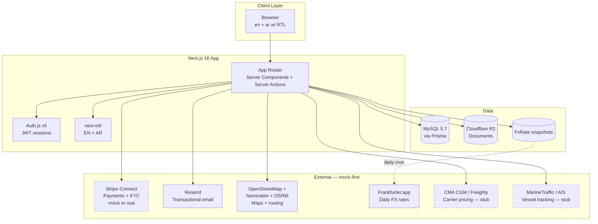
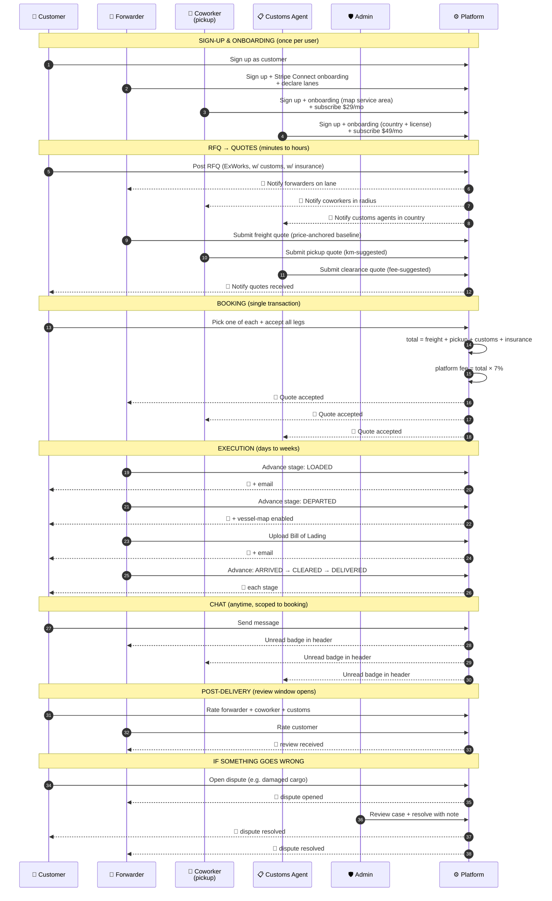

# GoShip — Workflow & PM Documentation

> **Purpose.** This document is the canonical hand-off for stakeholders, designers, sales, QA, and onboarding engineers. It describes WHO uses GoShip, WHAT they do step-by-step, HOW to verify each flow works, and HOW TO SELL IT. Sprint-level technical detail lives in `sprint.md`.

**Last updated:** 2026-05-16 (after Sprint 23)
**Build state:** 23 sprints complete · 101/101 tests passing · type-check clean · all external integrations mock-ready.
**Demo URL (local):** `http://localhost:3000/en`

---

## Table of contents

1. [Executive summary](#1-executive-summary)
2. [Personas & roles](#2-personas--roles)
3. [System architecture](#3-system-architecture)
4. [Master workflow diagram](#4-master-workflow-diagram)
5. [Role-by-role scenarios](#5-role-by-role-scenarios)
6. [Cross-cutting flows](#6-cross-cutting-flows)
7. [End-to-end test scripts](#7-end-to-end-test-scripts)
8. [Edge cases & negative tests](#8-edge-cases--negative-tests)
9. [15-minute stakeholder demo script](#9-15-minute-stakeholder-demo-script)
10. [Sales one-pager (investor / prospect)](#10-sales-one-pager)
11. [Pre-launch checklist](#11-pre-launch-checklist)
12. [Roadmap](#12-roadmap)
13. [Generating the workflow image](#13-generating-the-workflow-image)
14. [Importing this doc into Google Docs](#14-importing-this-doc-into-google-docs)

---

## 1. Executive summary

GoShip is a **five-sided sea-freight marketplace** that lets a customer post a shipment once and receive bids from licensed forwarders, local pickup coworkers, and destination customs brokers — then book, pay, track, and rate them, all in one workflow.

**Built for:** SMEs and mid-market exporters/importers who currently negotiate freight, pickup, and customs as three separate phone-call workflows. GoShip collapses these into a single RFQ-to-delivery pipeline with deterministic pricing visibility and end-to-end accountability.

**Current state.** Functionally complete MVP + Phase 2 across 23 sprints. Every external dependency (payments, email, storage, maps, FX rates, carrier pricing, vessel tracking, subscriptions) has a mock adapter so the entire stack runs offline. English + Arabic with RTL. Web only (mobile deferred). Ready for visual design pass, then pilot.

---

## 2. Personas & roles

There are **five roles** in the platform. Each has a dedicated dashboard, its own permissions, and a specific job-to-be-done.

### 2.1 Customer (`CUSTOMER`)

| Field | Value |
|---|---|
| **Persona** | "Mariam, export manager at a ceramic-tile factory in Beirut." |
| **Job-to-be-done** | "I need to ship a 40ft container of tiles to Hamburg by month-end, at the best price I can get, with proof of where it is at all times." |
| **Frequency** | 5–50 shipments / month |
| **Primary KPI** | Quote-to-book conversion time; price competitiveness; on-time delivery |
| **Pain killed** | No longer needs to call 6 forwarders, chase coworker quotes by WhatsApp, separately arrange customs at destination. |

**Capabilities:**
- Post an RFQ (FOB or ExWorks INCOTERM)
- Optionally request customs clearance at destination
- Optionally add cargo insurance with declared value
- Compare quotes (price, transit, carrier, forwarder rating)
- Pick freight + pickup + customs in a single multi-leg booking
- Pay via Stripe (mocked in dev)
- Track stages: BOOKED → LOADED → DEPARTED → ARRIVED → CLEARED → DELIVERED
- See vessel position on a live map during transit
- Download Bill of Lading + invoice
- Chat with all booking parties
- Review the other parties post-delivery
- Open disputes if something goes wrong

### 2.2 Freight Forwarder (`FORWARDER`)

| Field | Value |
|---|---|
| **Persona** | "Ahmad, ops manager at Test Forwarders Ltd. in Lebanon." |
| **Job-to-be-done** | "Fill empty TEU slots on the lanes I serve. I need a lead pipeline that doesn't require cold-calling." |
| **Frequency** | Daily active |
| **Primary KPI** | Bid-win rate; gross margin per booking; payout speed |
| **Revenue model** | Per-booking platform commission (default 7%, configurable) deducted via Stripe Connect `application_fee_amount` |

**Capabilities:**
- Declare lanes (origin port → destination port + transit days)
- Receive RFQ inbox filtered to declared lanes
- See a baseline reference rate per RFQ (Sprint 17 carrier-pricing module)
- Submit quote (price, transit, carrier, validity)
- Manage won bookings: advance stages, upload BL/invoice
- View vessel position on map during transit
- Chat with customer + coworker + customs agent
- Receive reviews; rating shown on quote-comparison cards

### 2.3 Pickup Coworker (`COWORKER`)

| Field | Value |
|---|---|
| **Persona** | "Sami, owner-operator of a small trucking company in Beirut." |
| **Job-to-be-done** | "I have a 20ft truck. I want pickup jobs from factories near me to the local port. I don't want monthly retainers — pay per pickup." |
| **Frequency** | 1–10 pickups / week |
| **Primary KPI** | Job density (km driven that bill); subscription ROI |
| **Revenue model** | $29/month subscription (Sprint 19) + per-pickup payout. No platform commission on individual pickups in v1. |

**Capabilities:**
- Onboard: declare service center on map, radius, vehicle type, per-km rate, base fee
- Subscribe to receive RFQ inbox (required to quote)
- See ExWorks RFQs filtered by service radius (haversine distance from declared center)
- Submit pickup quote with suggested price pre-filled (`distance × per-km + base fee`)
- Manage won pickups: see factory address, contact, route map
- Chat + reviews

### 2.4 Customs Agent (`CUSTOMS_AGENT`)

| Field | Value |
|---|---|
| **Persona** | "Lukas, licensed customs broker in Hamburg." |
| **Job-to-be-done** | "I want clearance jobs for shipments arriving in Germany. I have a license, I know HS codes, I want a steady pipeline." |
| **Frequency** | 5–20 clearances / month |
| **Primary KPI** | Pipeline; license trust signal display |
| **Revenue model** | $49/month subscription (Sprint 19) + per-clearance payout. |

**Capabilities:**
- Onboard: country, broker license number, base fee, doc-set fee
- Subscribe to receive RFQ inbox (required to quote)
- See clearance RFQs filtered to operating country (matches `destinationPort.country`)
- Submit clearance quote (price, ETA days, notes)
- Manage won clearances
- Chat + reviews

### 2.5 Admin (`ADMIN`)

| Field | Value |
|---|---|
| **Persona** | "Internal ops — GoShip platform staff." |
| **Job-to-be-done** | "Keep the marketplace healthy: suspend bad actors, resolve disputes, monitor revenue." |

**Capabilities:**
- Full user/shipment/booking lists with search + filters
- Suspend / reactivate any user
- View dispute queue (OPEN / RESOLVED / REJECTED tabs)
- Resolve disputes with public note (both parties see verbatim)
- See platform revenue + booking volume on overview dashboard

---

## 3. System architecture



**Legend:** Dashed boxes = currently using mock adapter; flip env var to switch to real.

---

## 4. Master workflow diagram

End-to-end multi-leg shipment (ExWorks + customs clearance), showing every role from sign-up through delivery + review.



---

## 5. Role-by-role scenarios

> **Test setup.** Every scenario below assumes `npm run dev` is running and the dev seeds are loaded (`npm run seed:ports && npm run seed:dev && npm run seed:fx`). All 5 test accounts use password `Test1234!`.

### 5.1 CUSTOMER scenario

**Account:** `customer@test.local`
**Dashboard:** `/en/customer`

#### A. Onboarding (one-time)

| Step | Action | Expected result | Verifies |
|---|---|---|---|
| C-A1 | Visit `/en` → click "I need to ship cargo" | Sign-up form pre-fills role=customer | Sign-up flow |
| C-A2 | Fill email + password + full name | Account created, redirected to `/en/customer` | Auth.js + role guard |
| C-A3 | Open header settings cog → set display currency to EUR | Prices everywhere now show as € | Sprint 22 multi-currency |

#### B. Post an RFQ (FOB, simple)

| Step | Action | Expected result | Verifies |
|---|---|---|---|
| C-B1 | Dashboard → "New shipment request" | RFQ form loads | Routing |
| C-B2 | Origin: search "Beirut" → pick LBBEY | Port typeahead works | UN/LOCODE search |
| C-B3 | Destination: search "Hamburg" → pick DEHAM | Same | Same |
| C-B4 | Container: 40ft, weight 22000 kg, ready date: +3 days | Form valid | Validation |
| C-B5 | INCOTERM tab: FOB | No factory fields shown | Conditional form |
| C-B6 | Leave customs + insurance unchecked, submit | Redirect to shipment detail | Server action |
| C-B7 | Verify status badge = "RFQ open" | Pending forwarder bids | Status enum |

#### C. Post an RFQ (ExWorks + customs + insurance — the rich path)

| Step | Action | Expected result | Verifies |
|---|---|---|---|
| C-C1 | New shipment → INCOTERM tab: **ExWorks** | Factory section appears | Conditional form |
| C-C2 | Click into factory map → search "Beirut Industrial Zone 4" | Leaflet map zooms, nearest ports suggested | Sprint 12b geo |
| C-C3 | Pin a location → route line drawn to LBBEY | OSRM driving route appears | Routing |
| C-C4 | Pickup contact: name + phone | Saved | — |
| C-C5 | Tick **"Need customs clearance at destination"** | Customs agents in DE will be invited | Sprint 14 |
| C-C6 | Tick **"Add cargo insurance"** → declared value $25,000 | 1.5% premium ($375) shown | Sprint 20.1 |
| C-C7 | Publish | Shipment created with all 3 leg-flags set | — |

#### D. Compare and book (multi-leg)

Wait for quotes to come in (or seed them as forwarder/coworker/customs in parallel browser windows).

| Step | Action | Expected result | Verifies |
|---|---|---|---|
| C-D1 | Visit shipment detail | 3 columns: Freight / Pickup / Customs (only enabled legs) | Sprint 13 multi-leg form |
| C-D2 | Each forwarder card shows star rating + cheapest/fastest tags | Sprint 15 reviews + Sprint 5 ranking | Both |
| C-D3 | Click forwarder name → opens `/providers/forwarders/[id]` in new tab | Profile shows lanes + completed bookings | Sprint 23 directory |
| C-D4 | Back → select one of each leg | Total updates: freight + pickup + customs + insurance | Multi-leg math |
| C-D5 | "Accept & book all legs" → confirm modal | Booking created, redirect to `/en/customer/bookings/[id]?just_booked=1` | Sprint 6 |
| C-D6 | Booking page shows green "just booked" banner + booking number | Atomic transaction succeeded | Booking transaction |
| C-D7 | Total paid shows in EUR (with USD aside if `showUSDAside`) | Sprint 22 currency display | — |
| C-D8 | "Insured · €280.86 insurance premium (1.5% of €23,148.15)" line visible | Sprint 20.1 insurance | — |

#### E. Track shipment + interact

| Step | Action | Expected result | Verifies |
|---|---|---|---|
| C-E1 | Booking detail → tracking timeline shows 6 stages | Current at BOOKED | Sprint 7 |
| C-E2 | (After forwarder advances to DEPARTED) refresh page | Vessel map appears with blue anchor at origin port | Sprint 18 |
| C-E3 | Open Chat panel at bottom → send message | Other parties see unread badge in header | Sprint 16 |
| C-E4 | Click bell icon in header | `/notifications` page lists all events | Sprint 21 |
| C-E5 | (After all stages reach DELIVERED) Review panel unlocks | Star pickers for each counterparty | Sprint 15 |
| C-E6 | Submit 5★ for forwarder + comment | Forwarder's average rating updates | — |
| C-E7 | (If something went wrong) Click "Open a dispute" → pick reason → describe | Dispute shown to all parties + admin | Sprint 20.2 |

**Acceptance criteria:** Customer can post → book → pay → track → receive → review in under 10 minutes (assuming counterparts bid in <30 s in dev).

---

### 5.2 FORWARDER scenario

**Account:** `forwarder@test.local`
**Dashboard:** `/en/forwarder`

#### A. Onboarding

| Step | Action | Expected result | Verifies |
|---|---|---|---|
| F-A1 | Sign up role=forwarder, company "Test Forwarders Ltd." | Account + ForwarderProfile created | Sign-up |
| F-A2 | Dashboard shows "Complete onboarding" card | Stripe Connect required | Onboarding gate |
| F-A3 | Click → mock mode: one-click "Mark me as ready" | `onboardingComplete=true` | Sprint 5 mock |
| F-A4 | "Manage lanes" → add Beirut → Hamburg, 18 days transit, active | Lane stored | Sprint 3 |

#### B. Receive and bid on an RFQ

| Step | Action | Expected result | Verifies |
|---|---|---|---|
| F-B1 | Bell icon shows "1" after customer posts RFQ on lane | Notification fan-out worked | Sprint 21 |
| F-B2 | RFQ inbox shows the shipment | Lane match filter | Sprint 4 |
| F-B3 | Open RFQ detail | Sky panel: "Reference rate: $X, Y transit days via Hapag-Lloyd" | Sprint 17 carrier pricing |
| F-B4 | Form is pre-filled with baseline | One-click to submit at suggested rate | — |
| F-B5 | Adjust price down 10%, submit | Quote stored as PENDING | Sprint 4 |
| F-B6 | Customer notified | Bell increments on customer side | — |

#### C. Manage won booking

| Step | Action | Expected result | Verifies |
|---|---|---|---|
| F-C1 | (After customer books) "1 booking" card on dashboard | Aggregate from `db.booking.count` | — |
| F-C2 | Open booking → "Advance to LOADED" button visible | Next-stage button | Sprint 7 |
| F-C3 | Click → tracking timeline advances + customer notified by email AND in-app | Stage transition triggers email + notification | Sprints 7 + 21 |
| F-C4 | After DEPARTED → vessel map appears with great-circle route + animated position | Sprint 18 | — |
| F-C5 | Upload Bill of Lading PDF → customer notified | Sprint 7 docs + Sprint 21 notification | — |
| F-C6 | Continue stages to DELIVERED | Tracking complete | — |
| F-C7 | After DELIVERED → review panel lets forwarder rate the customer | Sprint 15 | — |

---

### 5.3 COWORKER scenario

**Account:** `coworker@test.local`
**Dashboard:** `/en/coworker`

#### A. Onboarding

| Step | Action | Expected result | Verifies |
|---|---|---|---|
| K-A1 | Sign up role=coworker, display "Beirut Pickup Co." | Account + CoworkerProfile created | Sign-up |
| K-A2 | Onboarding → set service center on map (drop pin on Beirut) | Lat/lng saved | Sprint 11 |
| K-A3 | Radius 60 km, vehicle Truck-20ft, $1.50/km, base fee $20 | Saved | — |
| K-A4 | Dashboard now shows "Activate your membership" rose banner | Subscription gate (Sprint 19) | — |
| K-A5 | `/coworker/subscription` → click "Activate (mock)" | 30-day period, status=ACTIVE | Sprint 19 |
| K-A6 | Banner replaced with emerald "Active — renews on YYYY-MM-DD" | — | — |

#### B. Receive and bid on a pickup RFQ

| Step | Action | Expected result | Verifies |
|---|---|---|---|
| K-B1 | (After customer posts ExWorks RFQ in Beirut) bell ticks | Notification fan-out (Sprint 21) | — |
| K-B2 | Pickup inbox shows the RFQ — only because factory is within 60 km radius | Haversine filter (Sprint 12) | — |
| K-B3 | Open detail → map shows factory, route to port, distance "12 km" | OSRM driving route (Sprint 12b) | — |
| K-B4 | Suggested price pre-filled: `12 × $1.50 + $20 = $38` | Pricing helper (Sprint 13) | — |
| K-B5 | Submit | Customer notified, pickup quote pending | — |

#### C. Manage won pickup

| Step | Action | Expected result | Verifies |
|---|---|---|---|
| K-C1 | (After customer books) "1 pickup" on dashboard | — | — |
| K-C2 | Booking detail shows factory address, contact name + phone | Sprint 13 | — |
| K-C3 | Chat with customer + forwarder | Sprint 16 | — |
| K-C4 | After DELIVERED → review panel | Sprint 15 | — |

---

### 5.4 CUSTOMS AGENT scenario

**Account:** `customs@test.local`
**Dashboard:** `/en/customs`

#### A. Onboarding

| Step | Action | Expected result | Verifies |
|---|---|---|---|
| U-A1 | Sign up role=customs, display "Hamburg Customs Brokers GmbH" | Account + CustomsAgentProfile | Sign-up |
| U-A2 | Onboarding → country DE, license "DE-CB-2024-018734", base $150, doc set $50 | Saved | Sprint 14 |
| U-A3 | Activate membership ($49/mo mock) | ACTIVE | Sprint 19 |

#### B. Receive and bid on a clearance RFQ

| Step | Action | Expected result | Verifies |
|---|---|---|---|
| U-B1 | (After customer posts RFQ to Hamburg with customs flag) bell ticks | — | — |
| U-B2 | Inbox shows only shipments to DE ports with `needsCustomsClearance=true` | Country filter | Sprint 14 |
| U-B3 | Open detail → suggested price `$150 + $50 = $200` pre-filled | Pricing helper | — |
| U-B4 | Submit | Customer notified | — |

#### C. Manage won clearance

Same pattern as coworker — booking detail, chat, review after DELIVERED.

---

### 5.5 ADMIN scenario

**Account:** `admin@test.local`
**Dashboard:** `/en/admin`

| Step | Action | Expected result | Verifies |
|---|---|---|---|
| A-1 | Dashboard overview | Cards: total users by role, shipments, bookings, platform revenue | Sprint 8 |
| A-2 | "Open disputes ({count})" quick-link | Count from `db.dispute.count({where:{status:'OPEN'}})` | Sprint 20.2 + 21 |
| A-3 | `/admin/users` → search "forwarder" → click → "Suspend" | User locked out at next session check | Sprint 8 |
| A-4 | `/admin/disputes` → OPEN tab → resolve a dispute with note | Both parties notified | Sprint 20.2 + 21 |
| A-5 | `/admin/bookings` → filter by date, see revenue rolled up | — | — |

---

## 6. Cross-cutting flows

These features touch multiple roles and are best tested with **two browser windows side-by-side**.

### 6.1 Chat (per booking)

- **Who:** Customer + Forwarder + (optional) Coworker + (optional) Customs Agent
- **Trigger:** ChatPanel appears on every booking detail page
- **Test:** Send a message as customer → forwarder sees rose `1` badge next to bell within seconds of page refresh.
- **Limits:** 4000 chars per message, no media in v1.

### 6.2 Notifications

8 event types fan out at write time. See Sprint 21 in `sprint.md` for the full list. Auto-mark-read on page visit.

### 6.3 Reviews (post-delivery, mutual)

- Unlocks only after tracking reaches `DELIVERED`.
- Each pair `(rater, rated)` can submit once.
- Rating average updates on the rated user's profile and shows in quote-comparison + public directory.

### 6.4 Disputes

- Customer OR forwarder can open. Coworker and customs agent cannot (narrower contract).
- One OPEN dispute per booking at a time.
- Admin resolves with a public note both parties see verbatim.

### 6.5 Cargo insurance

- Opt-in at RFQ creation. Declared value × 1.5% (configurable `INSURANCE_RATE_BPS`).
- Snapshot onto Booking at acceptance time.
- Settlement is included in the Stripe total; payout is to platform (insurance is platform-held in v1; real underwriter integration deferred).

### 6.6 Multi-currency display

- USD is canonical (Stripe, all schema columns).
- User picks display currency in `/settings`. App converts at render time using latest `FxRate` snapshot.
- Rate snapshot via `npm run seed:fx` or daily Vercel cron at `/api/cron/fx-rates`.

### 6.7 Public directory

- `/providers/forwarders | coworkers | customs` accessible without auth.
- Listing pages support port-pair or country filter.
- Detail pages show trust signals (completed bookings, rating, lanes).
- Sign-up CTA on every detail page.

---

## 7. End-to-end test scripts

### Golden Path 1 — FOB, single leg

**Goal:** prove the simplest end-to-end booking works.

```
1. customer@test.local: post FOB RFQ Beirut → Hamburg, 40ft container.
2. forwarder@test.local: accept reference rate, submit quote.
3. customer@test.local: accept the single quote, book.
4. forwarder@test.local: advance BOOKED → LOADED → DEPARTED → ARRIVED → CLEARED → DELIVERED.
5. customer@test.local: leave 5★ review.
6. forwarder@test.local: leave 5★ review.
```

**Pass:** Booking shows DELIVERED + both ratings visible.

### Golden Path 2 — ExWorks + Customs + Insurance (multi-leg)

**Goal:** prove the full 3-leg multi-counterparty booking works.

```
1. customer: post ExWorks RFQ Beirut → Hamburg, customs requested, $25k insured.
2. forwarder: bid sea freight.
3. coworker: bid pickup ($38 suggested).
4. customs: bid clearance ($200 suggested).
5. customer: pick one of each → "Accept all legs" → confirm.
   Verify total = freight + $38 + $200 + insurance premium.
6. forwarder: advance through stages.
7. After DELIVERED: customer leaves review for all 3 counterparties.
```

**Pass:** Booking detail shows freight + pickup + customs + insurance line items.

### Golden Path 3 — Dispute resolution

```
1. Complete Golden Path 1 through DELIVERED.
2. customer: open dispute, reason DAMAGED_CARGO, describe.
3. forwarder: sees DISPUTE_OPENED notification.
4. admin: /admin/disputes → resolve RESOLVED with note "Refund issued out-of-band".
5. Both parties: see resolved status + admin note on booking page.
```

**Pass:** Notification fan-out to both parties + admin overview count decrements.

---

## 8. Edge cases & negative tests

| ID | Scenario | Expected behavior | Verified at |
|---|---|---|---|
| E1 | Forwarder tries to quote on a lane they don't serve | "You don't serve this lane" error | `forwarder/rfq/[id]/actions.ts` |
| E2 | Coworker tries to quote without active subscription | "Activate your membership" gate | Sprint 19 |
| E3 | Customs agent quotes on a shipment to a non-matching country | Wrong-country error | Sprint 14 |
| E4 | Customer tries to book on an EXPIRED quote | Stale-quote error | Sprint 13 |
| E5 | Two forwarders submit duplicate quotes (same shipment + user) | P2002 unique constraint → "You already quoted" | Schema unique |
| E6 | User opens dispute when one's already OPEN | "Wait for admin resolution first" | Sprint 20.2 |
| E7 | Review submitted before DELIVERED | "Reviews open once delivered" error | Sprint 15 |
| E8 | FX rate missing for currency → MoneyAmount falls back to USD silently | No error | Sprint 22 |
| E9 | Suspended user tries to sign in | Locked out at next auth check | Sprint 8 |
| E10 | Admin tries to suspend self | Allowed (no special guard; documented behavior) | — |

---

## 9. 15-minute stakeholder demo script

**Audience:** investor, prospective forwarder partner, or pilot customer.
**Setup:** seeded dev environment, 5 browser windows open and signed in to each test account, OBS or screen-share ready.

### Minute 0–2 — Set the problem

> "Today, a Lebanese exporter shipping tiles to Germany makes 6 phone calls: 3 forwarders for quotes, 1 trucker for pickup, 1 customs broker at Hamburg, and 1 insurance agent. They WhatsApp documents back and forth, get a price, and have no way to track the container."

### Minute 2–4 — Customer posts an RFQ

> "On GoShip, the same exporter does this once."

Demo:
- Sign in as customer
- New shipment → ExWorks → factory map (drop pin, OSM map flies in)
- Tick "customs clearance" + "insurance, $25k declared"
- Publish

### Minute 4–8 — Three counterparts bid in parallel

> "GoShip routes the RFQ to forwarders on the lane, coworkers in the radius, and customs agents in the country — automatically."

Demo (switch windows):
- Forwarder window: bell badge → "1" → open RFQ → baseline rate pre-filled → submit
- Coworker window: same — distance auto-computed
- Customs window: same — fee suggested

### Minute 8–10 — Customer books all three

Switch to customer window:
- Quote-comparison shows 3 columns
- Click forwarder name → public profile in new tab (show rating + completed bookings)
- Back → pick one of each → total updates → book

### Minute 10–12 — Lifecycle in fast-forward

Switch to forwarder window:
- Advance BOOKED → LOADED → DEPARTED
- Customer window: vessel map appears with anchor moving along great-circle
- Upload BL → customer notified
- Continue to DELIVERED

### Minute 12–14 — Trust & accountability

- Customer leaves 5★ review
- Show admin disputes panel (mention this is the safety net)
- Switch to Arabic locale to demonstrate i18n + RTL

### Minute 14–15 — Close

> "Everything you just saw runs on a stack that ships today. Stripe Connect handles KYC and global payouts. Cloudflare R2 handles documents. The marketplace is what we built — and the seven external integrations behind it (carriers, vessels, FX) all use a provider-flag pattern so we can flip from mock to live without touching the marketplace code."

---

## 10. Sales one-pager

> **For:** investor decks, prospect outreach, partner pitches.

### The problem

International sea freight is the last big logistics workflow that still runs on phone calls and WhatsApp. Three pain points:

1. **Price opacity.** An SME exporter typically calls 6 freight forwarders to triangulate a fair price. No instant comparison; no historical benchmark.
2. **Fragmented liability.** Pickup, freight, and customs are three separate contracts. When something goes wrong, each party points at the others.
3. **No real-time visibility.** Once the container leaves, the customer has no idea where it is until it arrives.

### The solution

**GoShip is a five-sided marketplace** that bundles freight, pickup, and customs into a single bookable workflow. One RFQ → one booking → one payment → end-to-end tracking → mutual reviews.

### Why now

- **Stripe Connect Express** removed the biggest historical blocker (per-country KYC + global payouts).
- **Open-source mapping** (OSM, Nominatim, OSRM) made factory-to-port routing free.
- **SME-grade SaaS norms** (Vercel, Neon/Postgres) collapsed infra cost; we're a four-week engineering effort, not a four-year platform build.

### Market

| Segment | Notes |
|---|---|
| **TAM** | Global ocean freight forwarding ≈ $200B annual gross. |
| **SAM** | SME-segment ocean freight in emerging markets (MENA, SE Asia, LATAM) ≈ $30B. |
| **Initial wedge** | Lebanon ↔ EU lane, ~200 SMEs known to ship 1–10 TEU/month. |

### Revenue model

Three streams, all real and configurable:

| Stream | How it works | Default rate |
|---|---|---|
| **Per-booking commission** | Deducted via Stripe Connect `application_fee_amount` from total. | 7% (configurable) |
| **Coworker subscription** | $29/mo via Stripe Billing (mocked). Required to receive pickup RFQs. | $29 |
| **Customs subscription** | $49/mo via Stripe Billing. Required to receive clearance RFQs. | $49 |

Forwarders are not subscribed — they pay only on win (per-booking commission). This minimizes friction for supply-side acquisition.

### Competitive landscape

| Competitor | Why GoShip wins |
|---|---|
| **Freightos** | Bigger but North-America-anchored; clunky for emerging-market SMEs. GoShip is Arabic-first. |
| **Flexport** | Enterprise-grade, white-glove; expensive for sub-50-TEU/month shippers. GoShip is self-serve. |
| **Local forwarders' WhatsApp** | Free but unmeasurable. GoShip adds price discovery + accountability without removing the personal relationship (chat is built-in). |

### Traction plan

| Phase | Duration | Goal |
|---|---|---|
| **Pilot** | 4 weeks | 5 forwarders + 3 coworkers + 2 customs agents + 10 customers on the Beirut↔EU lane |
| **Demo bookings** | 4 weeks | 25 real bookings, all-mock-paid, gather pricing & UX data |
| **Live payments** | 4 weeks | Flip `PAYMENT_PROVIDER=stripe`, take real commission on 10+ bookings |
| **Lane expansion** | Ongoing | Add MENA→Asia + MENA→Africa once Lebanon→EU is steady |

### Asks

- **Operational:** intros to 3 forwarders + 2 customs brokers on the Beirut↔EU lane
- **Capital:** $X for 4 months of runway covering hosting + Stripe fees + marketing
- **Strategic:** legal review of T&Cs (forwarder takes regulatory liability, platform aggregates payments)

---

## 11. Pre-launch checklist

Before flipping any `*_PROVIDER` env var from `mock` to real, verify:

- [ ] Stripe Connect platform account approved in target jurisdiction (note: UAE platform cannot onboard Lebanon-registered forwarders; re-register in US/UK or swap to Tap/MyFatoorah for MENA)
- [ ] `PLATFORM_COMMISSION_PERCENT` set explicitly in env
- [ ] `INSURANCE_RATE_BPS` confirmed with underwriter partner
- [ ] Resend sending-domain verified (replace `onboarding@resend.dev`)
- [ ] Native Arabic translation review (current AR is functional but not literary)
- [ ] T&Cs / Privacy Policy / Refund Policy reviewed by counsel
- [ ] Rate-limit sign-up + RFQ + message-send (Upstash Ratelimit recommended)
- [ ] Sentry or equivalent error tracking wired
- [ ] Daily DB backup on Neon/Supabase
- [ ] R2 bucket access keys rotated for production
- [ ] `CRON_SECRET` set on Vercel for `/api/cron/fx-rates`
- [ ] Move from MySQL → Postgres (recommended for Vercel deployment; see `sprint.md` § "Production deploy")
- [ ] Load-test with 100 concurrent RFQ posts (sprint 24+ if needed)
- [ ] Verify Arabic RTL on every page including the new `/providers/*` and `/notifications`
- [ ] Smoke-test all 3 golden paths end-to-end on staging
- [ ] Replace `next/dynamic({ ssr: false })` map components' loading placeholders with real skeletons (designer pass)

---

## 12. Roadmap

### Done (23 sprints)

| Phase | Sprints | Surface |
|---|---|---|
| **Foundation** | 1–10 | Auth + roles + ports + RFQ + quotes + booking + tracking + docs + admin + i18n + EN/AR |
| **Multi-counterparty** | 11–14 | Coworker role + ExWorks + maps + multi-leg bookings + Customs agent |
| **Trust & comms** | 15–16 | Reviews + per-booking chat |
| **Provider abstractions** | 17–18 | Carrier pricing stub + vessel tracking with map |
| **Revenue & accountability** | 19–20 | Subscriptions + cargo insurance + dispute system |
| **Pre-design polish** | 21–23 | Notification hub + multi-currency display + public provider directory |

### Next (planned, not built)

| Sprint | Theme | Why |
|---|---|---|
| **24 — Visual design pass** | Hand off to designer for typography, color, components, illustrations. | All functional surfaces frozen; designer can move freely. |
| **25 — Observability** | Sentry + structured logging + request IDs + rate limiting. | Pre-launch hardening. |
| **26 — Audit log** | `AuditLog` table for admin actions + immutable trail. | Disputes evidence. |
| **27 — Public API** | REST surface so forwarders can integrate their TMS. | Reduce supply-side onboarding friction. |
| **28 — Mobile** | React Native or PWA wrapper. | Coworkers + customs especially want this. |
| **29 — Real integrations** | Wire CMA CGM e-Commerce API, MarineTraffic AIS, Stripe Billing for subs. | Replace mocks. |
| **30 — Document generation** | Auto-generate commercial invoice / packing list PDFs from form data. | Replace manual upload. |

---

## 13. Generating the workflow image

The Mermaid diagrams above render automatically on GitHub, GitLab, and most modern markdown viewers (VSCode preview, Obsidian, Notion). Source-of-truth is [workflow.mmd](workflow.mmd) at the repo root.

### Easiest — Mermaid Live Editor (no install)

1. Open <https://mermaid.live>
2. Paste the contents of `workflow.mmd` into the left panel
3. Right panel renders instantly; click "Actions → PNG" to download

### Local — render to PNG via CLI

```bash
# First time: install a Chrome that Puppeteer can find
npx puppeteer browsers install chrome

# Then render (re-run anytime workflow.mmd changes)
npx -y @mermaid-js/mermaid-cli@latest -i workflow.mmd -o workflow.png -w 1800 -H 2600 -b white
```

On Windows, the `npx puppeteer browsers install chrome` step can fail mid-extract if antivirus is touching `~/.cache/puppeteer/chrome/`. If you see `Could not find Chrome` after install, delete `~/.cache/puppeteer/chrome/win64-*` and re-run, OR use Mermaid Live Editor instead.

### For slides

Export from Mermaid Live as SVG (vector — scales cleanly). Drop into Keynote / Slides / PowerPoint. The platform-flow boxes will remain crisp at any zoom level.

---

## 14. Importing this doc into Google Docs

GoShip's WORKFLOWS.md is markdown. Google Docs accepts markdown two ways:

**Option A — File → Open → Upload (preserves headings, tables, lists):**
1. In Google Drive: New → File upload → select `WORKFLOWS.md`.
2. Right-click the uploaded file → Open with → Google Docs.
3. Google Docs auto-converts headings + tables + numbered lists. Mermaid blocks become code blocks (you'll need to paste the rendered PNG in their place).

**Option B — Paste with markdown enabled:**
1. In Google Docs: Tools → Preferences → tick **"Automatically detect Markdown"**.
2. Copy the entire raw .md file.
3. Paste into a new doc. Headings + lists + tables format on-paste.

**Recommended:** Use Option A. After upload, replace each Mermaid `\`\`\`mermaid` block with the rendered PNG (run the command in § 13, drag the PNG into the doc).

**Why this matters for stakeholders.** Investors and partners prefer Google Docs over GitHub for review (they can comment + suggest edits inline). Keeping the source-of-truth in markdown means engineers can keep it accurate via PRs, and the Google Doc is regenerated when the markdown changes meaningfully.

---

## Appendix — Glossary

| Term | Meaning |
|---|---|
| **RFQ** | Request For Quote — what the customer posts |
| **FOB** | Free On Board — INCOTERM where the seller delivers to the origin port and the buyer takes over |
| **ExWorks (EXW)** | Seller makes goods available at the factory; buyer arranges all transport (incl. pickup) |
| **UN/LOCODE** | UN Code for Trade and Transport Locations (e.g. LBBEY = Beirut) |
| **TEU** | Twenty-foot Equivalent Unit (one 20ft container) |
| **HC** | High Cube (40HC is a 40ft container with extra height) |
| **LCL** | Less than Container Load (shared container, priced per CBM) |
| **BL** | Bill of Lading — receipt + title document |
| **HS code** | Harmonized System code for customs classification |
| **Connect** | Stripe Connect — multi-party payment & KYC product |
| **Lane** | A specific origin port → destination port pair, declared by a forwarder |

---

*End of WORKFLOWS.md. For sprint-level technical detail, see [sprint.md](sprint.md). For dev setup, see [README.md](README.md).*
